# Panoramica Architettura

Zuora Workflow Manager segue un'architettura pulita orientata ai servizi con chiara separazione delle responsabilità. Questa sezione ti fornisce una panoramica di come i componenti interagiscono tra loro.

## Architettura Generale

L'applicazione segue l'architettura **Service-Oriented** (SOA) con pattern MVC (Model-View-Controller).


### Layer Descritti

| Layer | Responsabilità | Componenti |
|-------|--------------|------------|
| **Presentation** | UI e API | Filament Resources, API Routes, CLI Commands |
| **Application** | Business logic e orchestrazione | Services, Jobs, Controllers |
| **Domain** | Entità e regole di dominio | Models, Form Requests, Policies |
| **Infrastructure** | Persistenza e infrastruttura | Database, Queue, Cache |
| **External** | Integrazioni esterne | Zuora API, Google OAuth |

## Componenti Principali

### 1. Filament UI Layer

Filament fornisce il pannello admin per la gestione dell'applicazione.


**Resources Filament:**
- `CustomerResource` - Gestione customer (CRUD)
- `WorkflowResource` - Gestione workflow e visualizzazione
- `TaskResource` - Gestione task con filtri avanzati
- `UserResource` - Gestione utenti
- `RoleResource` - Gestione ruoli e permessi

**Pages Filament:**
- Create/Edit forms per CRUD
- List tables con search e filtri
- Relation managers per relazioni modelli
- Custom pages per visualizzazioni complesse

### 2. Application Layer

#### Services

Il Service Layer incapsula la business logic:


**Responsabilità Services:**

| Service | Responsabilità | Metodi Chiave |
|---------|--------------|--------------|
| **ZuoraService** | Comunicazione con Zuora API | `listWorkflows()`, `getAccessToken()`, `downloadWorkflow()` |
| **WorkflowSyncService** | Orchestrazione sincronizzazione workflow | `syncCustomerWorkflows()`, `syncWorkflowRecord()` |
| **OAuthService** | Integrazione Google OAuth | `login()`, `callback()` |

#### Jobs

I Job gestiscono processi asincroni:

```php
// app/Jobs/SyncCustomersJob.php

class SyncCustomersJob implements ShouldQueue
{
    public $tries = 3;           // Retry 3 volte
    public $backoff = 60;         // 60 secondi tra retry
    public $timeout = 300;         // Timeout 5 minuti

    public function __construct(
        public Customer $customer
    ) {}

    public function handle(): void
    {
        $service = app(WorkflowSyncService::class);
        $service->syncCustomerWorkflows($this->customer);
    }
}
```

**Workflow Job Queue:**


### 3. Domain Layer

#### Models

Eloquent models rappresentano le entità del dominio:


**Models:**

| Model | Tabella | Responsabilità |
|-------|---------|--------------|
| **Customer** | `customers` | Credenziali Zuora, multi-tenancy |
| **Workflow** | `workflows` | Workflow sincronizzati da Zuora |
| **Task** | `tasks` | Task estratti dai workflow |
| **User** | `users` | Utenti del sistema |
| **Setting** | `settings` | Impostazioni applicazione |

### 4. Infrastructure Layer

#### Database

MariaDB 11.4 gestisce la persistenza dati:

```sql
-- Tabelle principali
customers     → Credenziali Zuora per customer
workflows      → Workflow sincronizzati
tasks          → Task estratti dai workflow
users          → Utenti del sistema
roles          → Ruoli Filament Shield
settings       → Impostazioni applicazione
jobs           → Job in coda
failed_jobs    → Job falliti
```

**Relazioni Database:**

```sql
-- Foreign Keys
workflows.customer_id → customers.id (ON DELETE CASCADE)
tasks.workflow_id → workflows.id (ON DELETE CASCADE)
```

#### Queue System

Laravel Queue gestisce job asincroni:

**Drivers Supportati:**
- `sync` - Esecuzione immediata (no queue)
- `database` - Persistenza in database
- `redis` - High-performance con Redis

**Workflow Queue:**

```mermaid
graph LR
    A[Dispatch Job] --> B[Queue]
    B --> C[Worker]
    C --> D{Success?}
    D -->|Sì| E[Mark Complete]
    D -->|No| F[Retry]
    F --> G{Max Tries?}
    G -->|No| B
    G -->|Sì| H[Move to Failed Jobs]
```



#### Cache

Laravel Cache ottimizza performance:

**Cache Drivers:**
- `array` - Per singola richiesta (sviluppo)
- `database` - Persistenza in database
- `redis` - High-performance (produzione)

**Cosa viene cachato:**
- OAuth token Zuora (1h TTL)
- Application config
- Route cache
- View cache

## Design Patterns Utilizzati

### 1. Service Layer Pattern

I servizi incapsulano business logic:

```php
// Service per logica complessa
class WorkflowSyncService
{
    public function __construct(
        private ZuoraService $zuoraService
    ) {}

    public function syncCustomerWorkflows(Customer $customer): array
    {
        // Business logic qui...
    }
}
```

**Benefici:**
- ✅ Separazione delle responsabilità
- ✅ Testabilità
- ✅ Riutilizzabilità
- ✅ Dependency Injection

### 2. Repository Pattern (via Eloquent)

I modelli fungono da repository:

```php
// Model come repository
$customer->workflows()->create($data);
$customer->workflows()->where('zuora_id', $id)->first();
$workflow->tasks()->where('state', 'pending')->get();
```

**Benefici:**
- ✅ API pulita per data access
- ✅ Query builder fluent
- ✅ Relazioni automatiche
- ✅ Lazy/Eager loading

### 3. Observer Pattern

Laravel events triggerano azioni automatiche:

```php
// app/Models/Customer.php

protected static function booted(): void
{
    static::created(function (Customer $customer) {
        SyncCustomersJob::dispatch($customer);
    });
}
```

**Workflow Observer:**


**Benefici:**
- ✅ Decoupling
- ✅ Reattività automatica
- ✅ Logica separata dal model

### 4. Strategy Pattern

Differenti queue drivers come strategie:

```php
// Configurable strategy
switch (config('queue.default')) {
    case 'sync':
        // Immediate execution
        break;
    case 'database':
        // Background processing
        break;
    case 'redis':
        // High-performance processing
        break;
}
```

**Benefici:**
- ✅ Flessibilità configurazione
- ✅ Scambiabilità driver
- ✅ Ambiente-specific optimization

### 5. Factory Pattern

Laravel Service Container crea istanze:

```php
// Automatic dependency injection
public function __construct(
    private ZuoraService $zuoraService
) {}

// Manual resolution
$service = app(ZuoraService::class);
```

**Benefici:**
- ✅ Singleton pattern
- ✅ Lazy loading
- ✅ Testability (mocking)

## Data Flow

### Workflow Synchronization Flow


### Task Extraction Flow


## Security Architecture

### Authentication & Authorization


### Data Protection

**Encryption:**
- `client_secret` - Criptato con EncryptedCast
- `APP_KEY` - Chiave crittografica
- Sessions - Criptate con Laravel

**RBAC:**
- Filament Shield per granular permissions
- Role-based access control
- Policy-based authorization

### API Security


## Performance Architecture

### Optimization Layers


**Caching Strategy:**
- OAuth tokens (1h TTL)
- Application config
- Route cache (production)
- View cache (production)

**Database Optimization:**
- Indexes su foreign keys
- Indexes su frequent queries
- Foreign key cascade operations

## Scalability Considerazioni

### Horizontal Scaling


**Scalabile orizzontalmente con:**
- Redis per queue distribuita
- Database read replicas
- Shared cache (Redis)
- Sticky sessions se necessario

### Vertical Scaling

**Ottimizzazioni:**
- Aumento risorse server
- Code workers multipli
- Database connection pooling
- PHP OPcache

## Prossimi Passi

<CardGroup cols={2}>
  <Card title="Service Layer" icon="cog" href="/architecture/service-layer">
    Dettagli sui servizi principali
  </Card>
  <Card title="Data Model" icon="database" href="/architecture/data-model">
    Schema database e relazioni
  </Card>
  <Card title="Design Patterns" icon="puzzle" href="/architecture/design-patterns">
    Pattern di design utilizzati
  </Card>
  <Card title="Core Concepts" icon="lightbulb" href="/core-concepts/customer">
    Concetti fondamentali del dominio
  </Card>
</CardGroup>

## Risorse

- 📖 [Laravel Architecture](https://laravel.com/docs/architecture-concepts)
- 📖 [Design Patterns PHP](https://refactoring.guru/design-patterns/php)
- 📖 [Service Layer Pattern](https://martinfowler.com/eaaCatalog/serviceLayer.html)

---

**Versione**: 1.4.0 |
**Ultimo Aggiornamento**: Dicembre 2025
